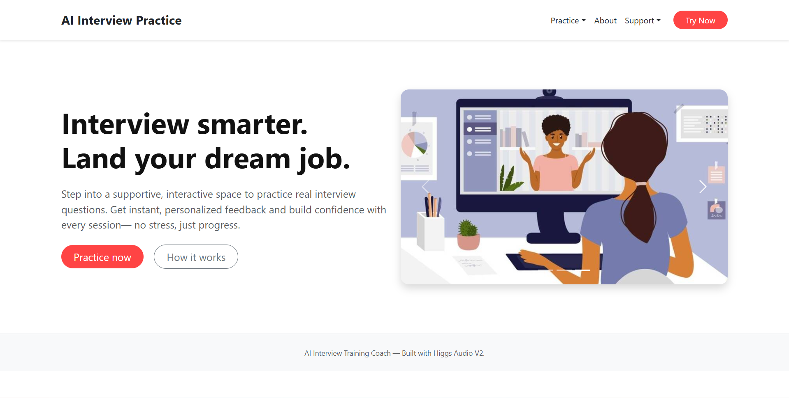
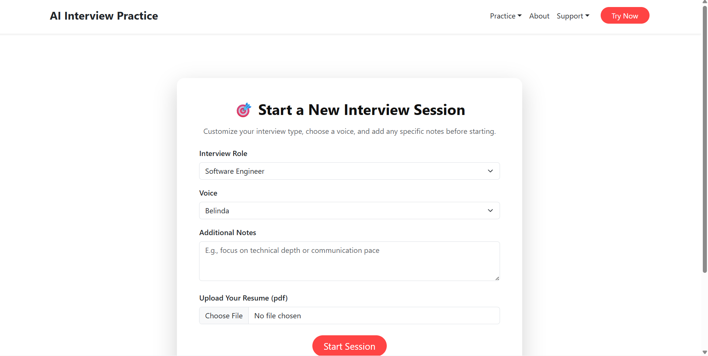
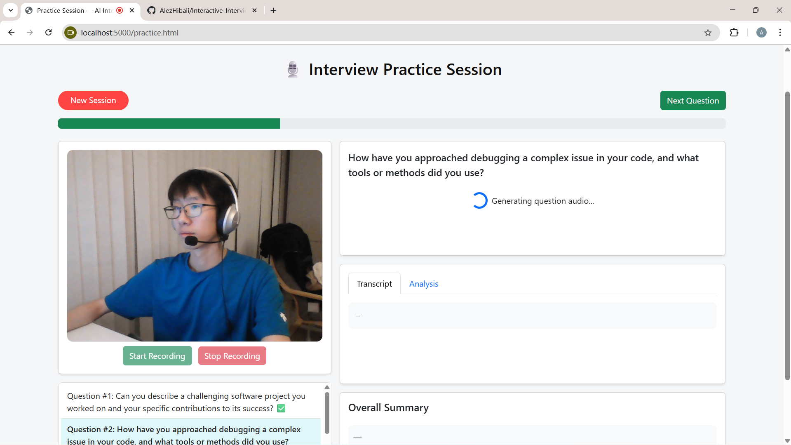
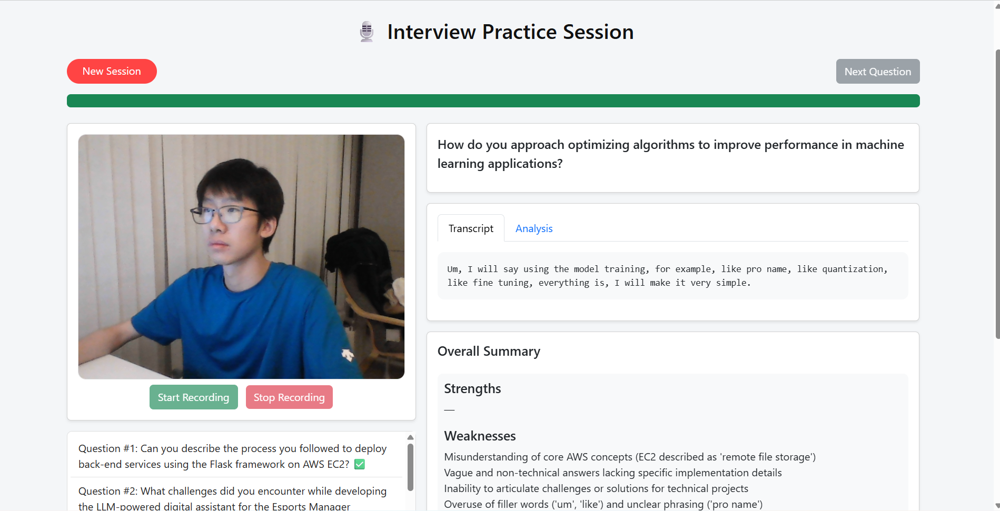
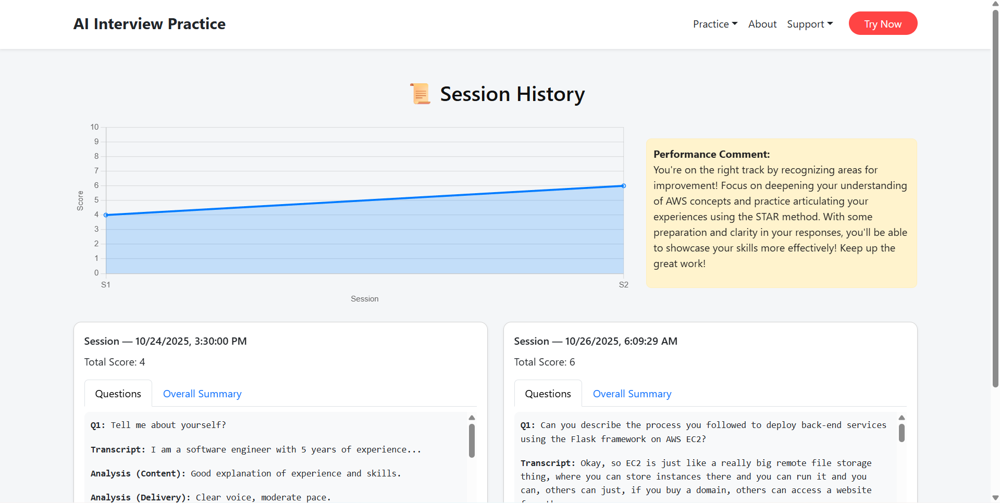

# AI Interview Training Coach

AI Interview Training Coach is an interactive web application designed to help users practice technical interviews with real-time feedback. Using LLMs (Large Language Models), the platform analyzes user responses, generates follow-up questions, provides detailed content and delivery analysis, and offers overall summaries and personalized coaching comments.


---

## Features

* **Interactive Interview Practice**
* **Real-Time Analysis**
* **Overall Summary**
* **Session History**
* **Data-Driven Insights**
* **Resume-Based Question Generation**

---

## Tech Stack

* **Frontend:** HTML, CSS, JavaScript, Bootstrap 5, Chart.js
* **Backend:** Python, Flask
* **AI Models:** OpenAI GPT-4o-mini, langchain, RAG, Higgs Audio V2
* **Audio Processing:** Higgs Audio V2 for real-time speech-to-text analysis

---

## Screenshot







---

## Demo Video

Check out the demo video on YouTube: [Watch Demo](https://www.youtube.com/watch?v=Xpx6502MAKA)

---

## Installation

1. **Clone the repository**

```bash
git clone https://github.com/your-username/ai-interview-coach.git
cd ai-interview-coach
```

2. **Create a virtual environment**

```bash
python -m venv env
source env/bin/activate  # Linux/Mac
env\Scripts\activate     # Windows
```

3. **Install dependencies**

```bash
cd backend
pip install -r requirements.txt
```

4. **Set API Keys**

```bash
export OPENAI_API_KEY="your_openai_api_key"
export BOSON_API_KEY="your_boson_api_key"
```

---

## Usage

1. **Start the Flask backend**

```bash
cd backend
python app.py
```

2. **Open the frontend**

* Open `localhost:5000/index.html` in a browser, or deploy using a web server.

---

## Project Structure

```
ai-interview-coach/
├─ backend/
│  ├─ app.py                 # Main Flask app
│  ├─ config.py              # Configuration
│  ├─ higgs_client.py        # Higgs Audio V2 integration
│  ├─ llm_client.py          # LLM interface (GPT-4o-mini)
│  ├─ model_prompts.py       # Prompt templates
│  ├─ rag_question.py        # RAG question generation
│  ├─ requirements.txt       # Python dependencies
│  ├─ tmp/                   # Temporary files
│  ├─ uploaded_resumes/      # Uploaded resumes
│  └─ __pycache__/           # Python cache
├─ frontend/
│  ├─ index.html             # Landing page
│  ├─ new_session.html       # Start session page
│  ├─ practice.html          # Active practice page
│  ├─ history.html           # Session history page
│  ├─ app.js                 # Main JS
│  ├─ dashboard.js           # Dashboard JS
│  ├─ practice.js            # Practice session JS
│  └─ static/
│     ├─ style/              # CSS files
│     └─ src/img/            # Screenshots
└─ README.md
```

---

## Contact

* Developer: Daixin Tian
* Email: [ali.daixin.tian@gmail.com](mailto:ali.daixin.tian@gmail.com)
* GitHub: [https://github.com/AlezHibali](https://github.com/AlezHibali)
